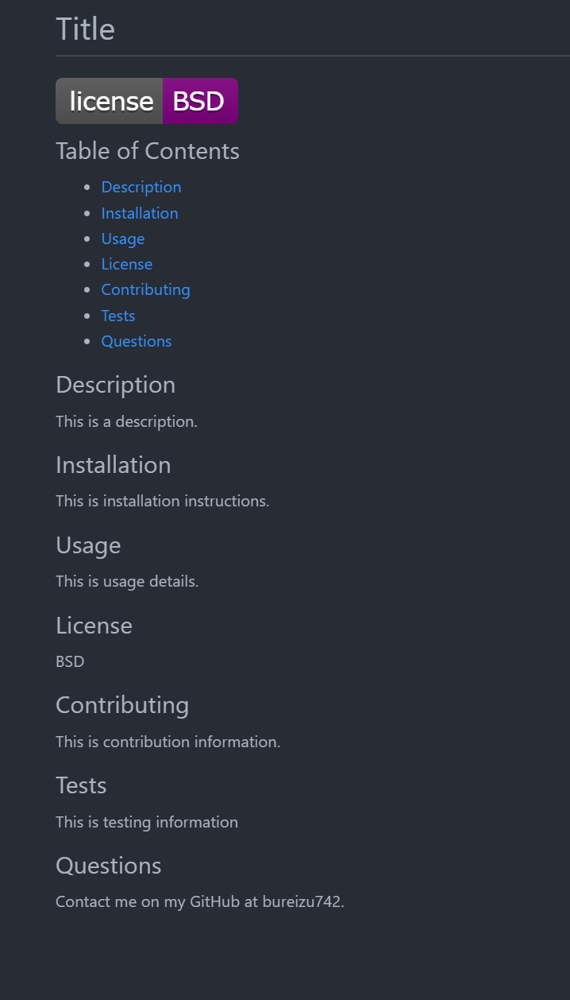

# Professional README Generator

## Table of Contents

- [Description](#description)
- [Visuals](#visuals)
- [Resources](#resources)

## Description

Accepts user input to generate a README file. Takes in a title, a description, 
installation instructions, usage instructions, license information, information on contributing, information on testing, and a GitHub link for questions. Outputs a README file in markdown format, displaying all the input information.

## Visuals

## Resources

[Repository](https://github.com/Bureizu742/professional-readme-generator)

[Raw Generated README](https://raw.githubusercontent.com/Bureizu742/professional-readme-generator/main/output/TITLE.md)

[Video Demonstration](https://drive.google.com/file/d/1l-egB70RMz01GazVBhjHQ_TmLRi__Wjv/view)